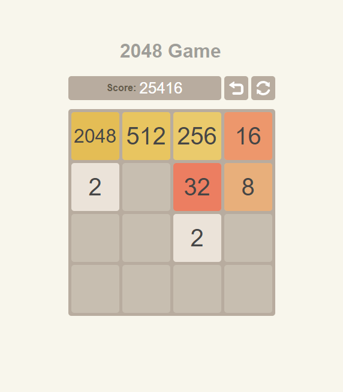

# 2048 Game

2048 Game implementation based on Preact+Redux

## How to play

Use your __arrow keys__ to move the tiles. When two tiles with 
the same number touch, they __merge into one__!

## Play

[ [>> **Play online** <<](https://avin.github.io/2048-game ) ]

## License

MIT © [avin](https://github.com/avin)
